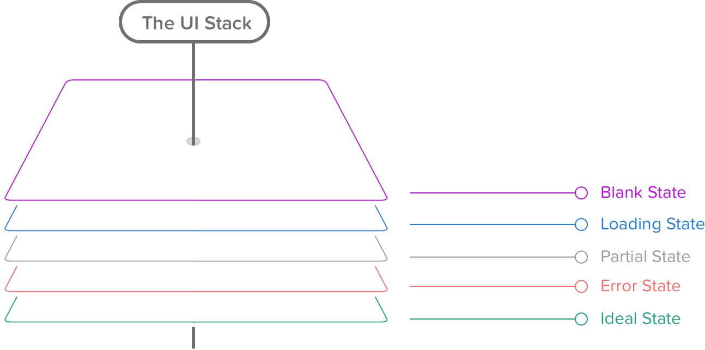

# RemoteData

**Slaying a UI Antipattern with Angular.**

[](https://travis-ci.org/joanllenas/ngx-remotedata)
[](https://badge.fury.io/js/ngx-remotedata)

Library inspired by [Kris Jenkins](https://twitter.com/krisajenkins) blog post about [How Elm slays a UI antipattern](http://blog.jenkster.com/2016/06/how-elm-slays-a-ui-antipattern.html), which mixes pretty well with [another article](http://scotthurff.com/posts/why-your-user-interface-is-awkward-youre-ignoring-the-ui-stack) written by [Scott Hurff](https://twitter.com/scotthurff) about what he calls the _UI Stack_.



## What we are trying to solve

You are making an API request, and you want to display different things based on the status of the request.

### The Boolean approach

```ts
export interface SunriseSunset {
  isLoading: boolean;
  error: string;
  data: {
    sunrise: string;
    sunset: string;
  };
}
```

Let’s see what each property means:

- `isLoading`: It‘s true while the remote data is being fetched.
- `error`: It‘s either null (no errors) or any string (there are errors).
- `data`: It’s either null (no data) or an object (there is data).

**There are a few problems with this approach** but the main one is that it is possible to create invalid states such:

```
{
  isLoading: true,
  error: 'Fatal error',
  data: {
    sunrise: 'I am good data.',
    sunset: 'I am good data too!',
  }
}
```

Our template will have to use complex `*ngIf` statements to make sure that we are displaying precisely what we should.

### The RemoteData approach

Instead of using a complex object we use a single data type to express all possible request states:

```ts
export type RemoteData<T, E = string> =
  | NotAsked
  | Loading<T>
  | Failure<E>
  | Success<T>;
```

This approach **makes it impossible to create invalid states**.

## Installation

`npm install --save ngx-remotedata`

## Basic Usage

```ts
// app.module.ts

import { RemoteDataModule } from 'ngx-remotedata';

@NgModule({
  imports: [
    // (...)
    RemoteDataModule
  ]
})
```

```ts
// app.component.ts

import { Loading, NotAsked, Success, Failure } from 'ngx-remotedata';

@Component({
  selector: 'app-root',
  templateUrl: './app.component.html'
})
export class AppComponent {
  remoteData = new NotAsked();

  setNotAsked() {
    this.remoteData = new NotAsked();
  }

  setLoading() {
    this.remoteData = new Loading();
  }

  setSuccess() {
    this.remoteData = new Success('ok');
  }

  setFailure() {
    this.remoteData = new Failure('ko');
  }
}
```

```html
<!-- app.component.html -->

<ul>
  <li><button (click)="setNotAsked()">Not Asked</button></li>
  <li><button (click)="setLoading()">Loading</button></li>
  <li><button (click)="setSuccess()">Success</button></li>
  <li><button (click)="setFailure()">Failure</button></li>
</ul>

<hr />

<h4 *ngIf="remoteData | isNotAsked">Not Asked</h4>
<h4 *ngIf="remoteData | isLoading">Loading...</h4>
<h4 *ngIf="remoteData | isSuccess" style="color: green">
  {{ remoteData | successValue }}
</h4>
<h4 *ngIf="remoteData | isFailure" style="color: red">
  {{ remoteData | failureValue }}
</h4>
```

## Some examples

- [The basics](src/app/examples/basics)
- [Plain old services](src/app/examples/pos)
- [Ngrx](src/app/examples/ngrx)

## Api

### RemoteData

`RemoteData<T, E = string>`

`RemoteData` is used to annotate your request variables. It wraps all possible request states into one single union type. Use the parameters to specify:

- `T`: The success value type.
- `E`: The error value type (`string` by default).

### NotAsked

`NotAsked`

When a `RemoteData` is an instance of the `NotAsked` class, it means that the request hasn't been made yet.

### Loading

`Loading<T>`

When a `RemoteData` is an instance of the `Loading` class, it means that the request has been made, but it hasn't returned any data yet. The `Loading` class can contain a value of the same `T` type as the `Success` class. Useful when you want to use the last `Success` value while the new data is being fetched.

### Success

`Success<T>`

When a `RemoteData` is an instance of the `Success` class, it means that the request has completed successfully and the new data (of type `T`) is available.

### Failure

`Failure<E>`

When a `RemoteData` is an instance of the `Failure` class, it means that the request has failed. You can get the error information (of type `E`) from the payload.

## Pipes

### isNotAsked

`isNotAsked | RemoteData<any> : boolean`

Returns true when `RemoteData` is a `NotAsked` instance.

### isLoading

`isLoading | RemoteData<any> : boolean`

Returns true when `RemoteData` is a `Loading` instance.

### anyIsLoading

`anyIsLoading | Observable<RemoteData<any>>[] : boolean`

Returns true when any item in `RemoteData[]` is a `Loading` instance.

### isFailure

`isFailure | RemoteData<any> : boolean`

Returns true when `RemoteData` is a `Failure` instance.

### isSuccess

`isSuccess | RemoteData<any> : boolean`

Returns true when `RemoteData` is a `Success` instance.

### successValue

`successValue | RemoteData<T> : (T | undefined)`

Returns the `Success` payload (of type `T`) when `RemoteData` is a `Success` instance or `undefined` instead.

### loadingValue

`loadingValue | RemoteData<T> : (T | undefined)`

Returns the `Loading` payload (of type `T`) when `RemoteData` is a `Loading` instance or `undefined` instead.

### failureValue

`failureValue | RemoteData<T, E> : (E | undefined)`

Returns the `Failure` payload (of type `E`) when `RemoteData` is a `Failure` instance or `undefined` instead.
